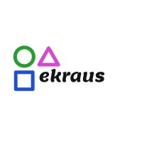

<!-- AUTO-GENERATED-CONTENT:START (STARTER) -->
<p align="center">
  <a href="https://www.gatsbyjs.com">
    
  </a>
</p>
<h1 align="center">
  Ekraus
</h1>

Ekraus is a comprehensive solution for agro operations. Our goal is to build an eco-system around farmers that facilitates their operations and makes their products more accessible.


## 🚀 Quick start

1.  **Clone the repository**

    To get started, clone this repository into your working environment

    ```shell
    # 
    git clone https://github.com/e-kraus/ekraus.git
    ```

2.  **Install the necessary dependencies**

    Navigate into your new site’s directory and start it up.

    ```shell
    cd ekraus/
    npm install
    ```

3.  **Run the program**

    You are now ready to begin!
    Run the following code snippet to spin up a local instance of our site
     ```shell
    npm run develop
    ```

4. **Get Started**

    To view the local instance of our website, open your browser and go to
    `http://localhost:8000`
    

    

## 🚀 Have an quick look at What's inside?  🧐

A quick look at the top-level files and directories you'll see in this project.

    .
    ├── node_modules
    ├── src
    ├── .gitignore
    ├── .prettierrc
    ├── gatsby-browser.js
    ├── gatsby-config.js
    ├── gatsby-node.js
    ├── gatsby-ssr.js
    |-- tailwind.config.js
    |-- postcss.config.js
    ├── LICENSE
    ├── package-lock.json
    ├── package.json
    └── README.md


## 💫 Deploy

[This site is deployed on netlify. Click me to go there](https://ekraus.netlify.app/)

Netlify unites an entire ecosystem of modern tools and services into a single, simple workflow for building high performance sites and apps.

